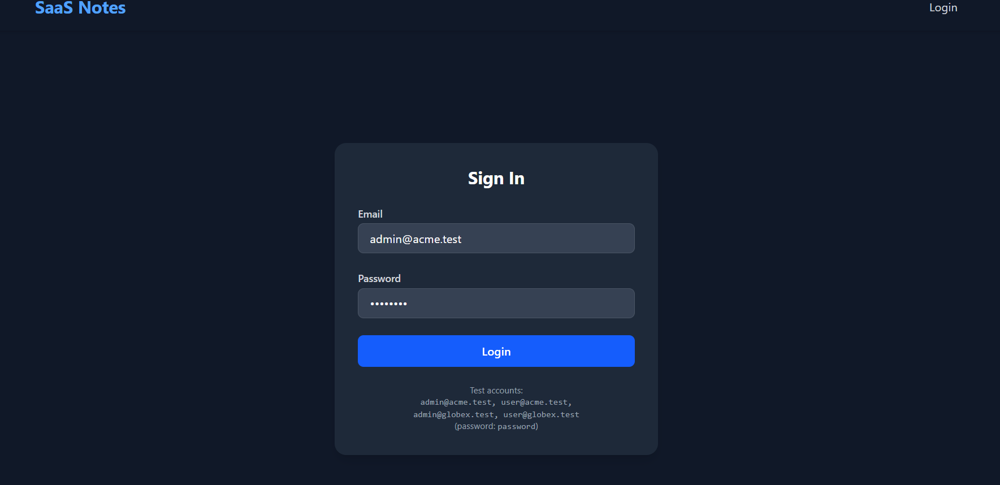
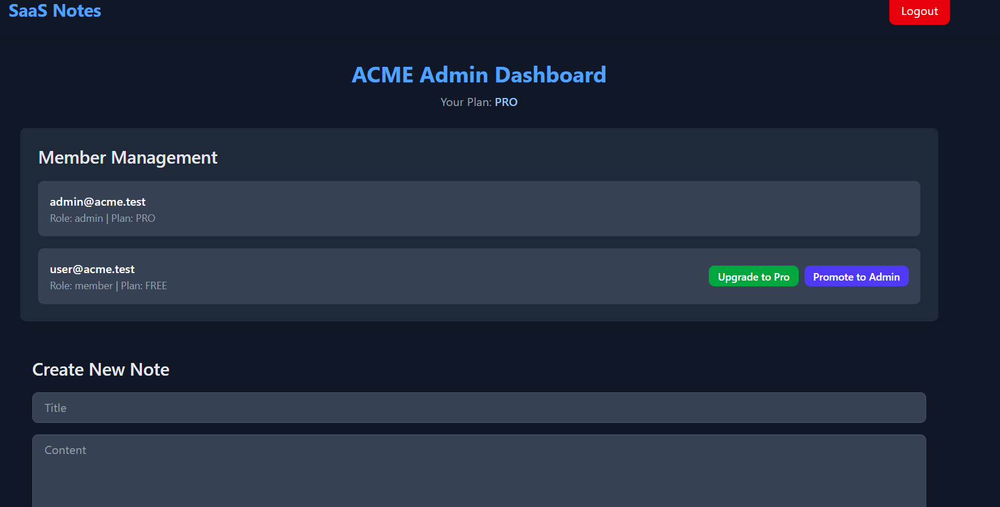
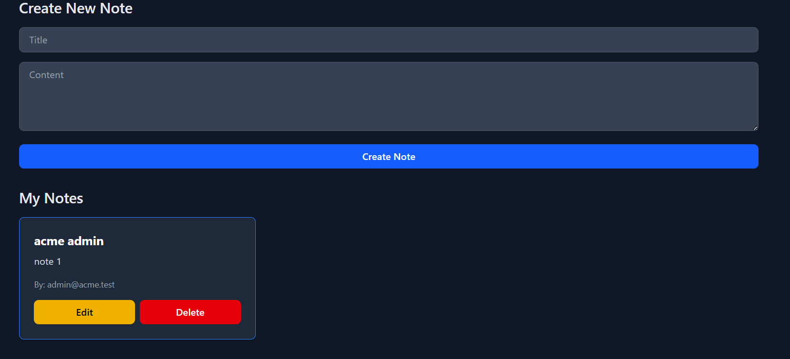
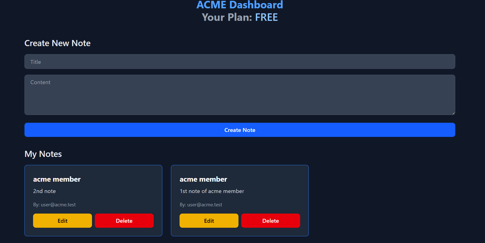

# SaaS Notes App 📝

A multi-tenant SaaS Notes Application built with **MERN stack (MongoDB, Express, React, Node.js)**.  
Supports **role-based access (Admin & Member)**, **note management**, and **tenant upgrades**.

---

saas-notes/
│── backend/        # Express + MongoDB backend
│── frontend/       # React + Vite + Tailwind frontend
│── docs/           # Screenshots for README
│── .gitignore
│── README.md


## 🚀 Features
- 🔐 JWT Authentication (Login system)
- 👥 Role-based Dashboards (Admin & Member)
- 📝 Create, Edit, Delete Notes
- 🏢 Multi-Tenant Support (ACME, Globex, etc.)
- 📈 Admin: Upgrade Tenant Plan, Promote Members

---

## 📸 Screenshots

### 🔑 Login Page


### 🛠 Admin Dashboard


### 📝 Create Note


### 👤 Member Dashboard


---

## ⚙️ Tech Stack
- **Frontend**: React, Vite, TailwindCSS
- **Backend**: Node.js, Express.js
- **Database**: MongoDB
- **Auth**: JWT

---

## 🛠 Setup Instructions

### 1️⃣ Clone the repo
```bash
git clone https://github.com/your-username/saas-notes.git
cd saas-notes

frontend
cd frontend
npm install

backend
cd ../backend
npm install

Backend .env.example
MONGO_URI=
JWT_SECRET=
PORT=5000
FRONTEND_URL=http://localhost:5173

fronetEnd
API_URL=http://localhost:5000/api

#start backend
cd backend
npm run dev

#start frontend
cd frontend
npm run dev


6️⃣ Test Accounts
Email	            Password	Role	Tenant

admin@acme.test     password	Admin	ACME
user@acme.test      password	Member	ACME
admin@globex.test   password	Admin	Globex
user@globex.test    password	Member	Globex